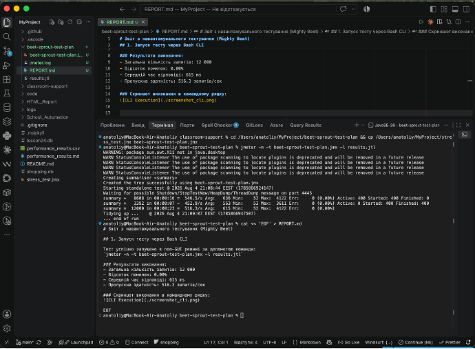
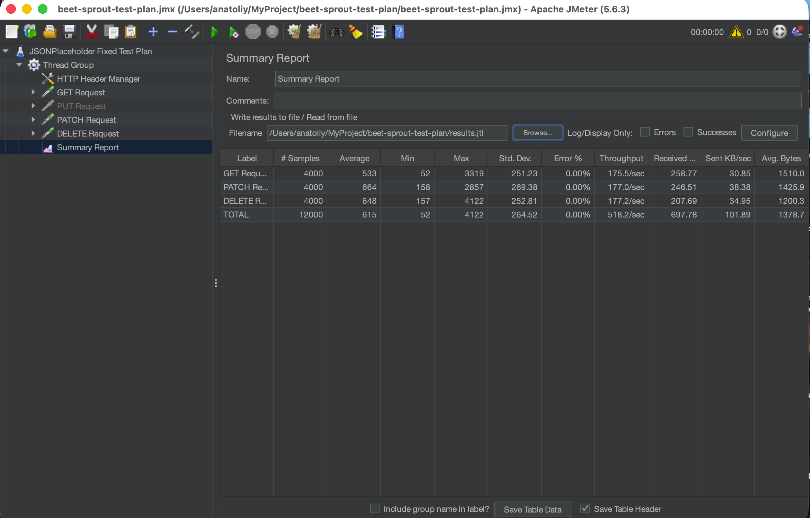

# Звіт з навантажувального тестування (Mighty Beet)

## 1. Запуск тесту через Bash CLI

Тест успішно запущено в non-GUI режимі за допомогою команди:
`jmeter -n -t beet-sprout-test-plan.jmx -l results.jtl`

### Скриншот виконання в командному рядку:

---

## 2. Графічний аналіз результатів (Summary Report)

Результати тестування, завантажені з файлу `results.jtl` у слухач **Summary Report**:

| Label | # Samples | Average (ms) | Min (ms) | Max (ms) | Error % | Throughput |
| :--- | :---: | :---: | :---: | :---: | :---: | :---: |
| **GET Request** | 4000 | 533 | 52 | 3319 | 0.00% | 175.5/sec |
| **PATCH Request** | 4000 | 664 | 158 | 2857 | 0.00% | 177.0/sec |
| **DELETE Request** | 4000 | 648 | 157 | 4122 | 0.00% | 177.2/sec |
| **TOTAL** | **12000** | **615** | **52** | **4122** | **0.00%** | **518.2/sec** |

### Скриншот Summary Report з JMeter GUI:

